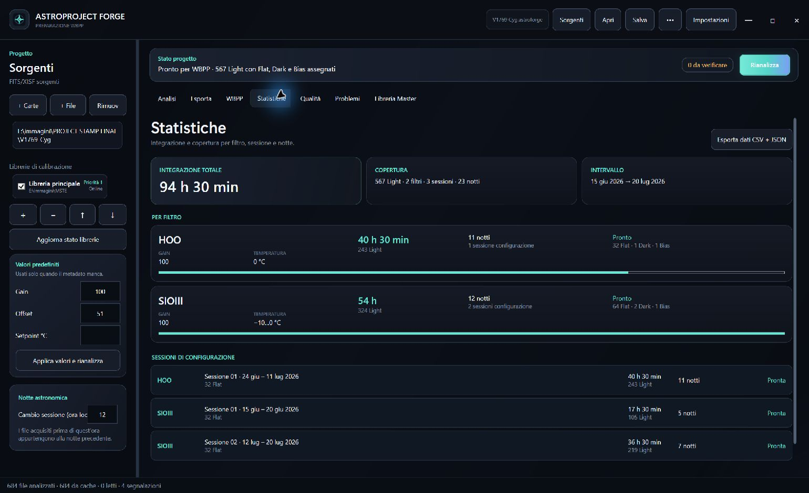
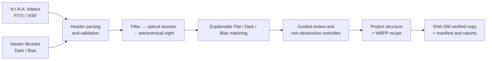

# AstroProject Forge

[Italiano](docs/README.it.md) · **English**

**Turn multi-night N.I.N.A. acquisitions into a reviewable PixInsight WBPP
project without manually sorting hundreds of files.**

AstroProject Forge is a native Windows application that reads FITS/XISF
metadata, reconstructs astronomical nights and optical configurations, matches
Flat, Dark and Bias calibration frames, and exports a verified structure for
PixInsight WeightedBatchPreprocessing.

> Active pre-release development. Calibration correctness and source-file
> safety take priority over feature count. This is not yet a commercial build.



## The problem

A faint target may require weeks of acquisition. One project can contain
multiple filters, sessions crossing midnight, optical-train changes, and several
Flat sets. Grouping everything by calendar date is scientifically unsafe:

- six HOO nights may legitimately share one Flat set;
- changing filter, rotation, focus train, or cleaning an optical surface starts
  a new optical configuration;
- returning to HOO later must not apply new Flats to earlier HOO sessions;
- Dark and Bias masters must match sensor, geometry, Gain, Offset, temperature,
  exposure, and readout mode.

AstroProject Forge builds an explicit project map and reports anything it cannot
prove instead of silently guessing.

## Workflow



1. Select one or more acquisition folders and a Master Library.
2. The app reads headers only; image pixels are not loaded during inventory.
3. Frames are organized as
   `Filter → Configuration sessions → Nights / Flats / Masters`.
4. The matcher proposes compatible calibrations and explains missing,
   incompatible, or ambiguous candidates.
5. Metadata can be corrected without rewriting the original file. A Flat set
   can be linked to one night, multiple nights, or a complete session.
6. The app recommends only the WBPP Grouping Keywords that are actually needed,
   including the correct `Pre/Post` configuration for `FLATSET`, `DARKSET`,
   `BIASSET`, and `TARGET`.
7. Export creates a resumable, verified project ready for final inspection in
   PixInsight.

## Implemented capabilities

### Project intelligence

- FITS and XISF parsing;
- Light, Flat, Dark, Bias, and Dark-flat classification;
- configurable astronomical-night boundary across midnight;
- automatic Flat Epochs and manual multi-session Flat linking;
- hierarchical project tree instead of a flat file list;
- individual and batch overrides with value provenance;
- integration time by filter, session, and night;
- date ranges, Gain, temperature, and calibration coverage;
- CSV and JSON statistics export.

### Calibration review and WBPP

- explainable Flat, Dark, and Bias matching;
- configured Master Library candidates take priority over source-folder copies;
- guided review queue with reason, candidate count, and suggested action;
- explicit Dark/Bias assignment to one Light or the complete night;
- adaptive WBPP Grouping Keywords;
- final-tree preview, WBPP guide, and decision manifest.

### Safety and recovery

- source images remain read-only;
- resumable staging export with SHA-256 verification;
- portable `.astroforge` document with atomic saves;
- autosave after the first explicit project save;
- incremental header cache that invalidates only changed files;
- safe cache cleanup that cannot delete astronomical images.

## Project hierarchy

```text
HOO
└── Sessions
    ├── Session 01 · Jun 15–28
    │   ├── Astronomical nights
    │   ├── Linked Flat set
    │   ├── Master Dark
    │   └── Master Bias
    └── Session 02 · Jul 02–05
        └── ...
SIOIII
└── Sessions
    └── ...
No filter
└── Sensor sessions
    ├── Dark
    └── Bias
```

Calendar date, astronomical night, and optical-configuration session are
different concepts. They must not all be reduced to `DATE-OBS`.

## Prerequisites

- Windows 10 or Windows 11;
- Light folders and their Flat frames;
- a Dark/Bias Master Library is strongly recommended;
- PixInsight is not required to scan and organize a project;
- .NET SDK 10 is required only when building from source.

The Master Library location is a user setting. No drive letter or personal path
is hard-coded.

## Recommended Master Library

The ideal structure exposes camera, Gain, Offset, temperature, and exposure:

```text
MasterLibrary/
├── Camera-ZWO-ASI2600MC/
│   ├── Gain-100/
│   │   ├── Offset-50/
│   │   │   ├── Temp--10C/
│   │   │   │   ├── Dark/
│   │   │   │   │   ├── masterDark_60s.xisf
│   │   │   │   │   ├── masterDark_300s.xisf
│   │   │   │   │   └── masterDark_600s.xisf
│   │   │   │   └── Bias/
│   │   │   │       └── masterBias.xisf
│   │   │   └── Temp-0C/
│   │   │       └── ...
│   │   └── Offset-51/
│   │       └── ...
│   └── Gain-0/
│       └── ...
└── Secondary-Camera/
    └── ...
```

These exact folder names are not mandatory. FITS/XISF headers are authoritative;
folder and file names are fallback evidence. Reliable masters should identify:

- camera/sensor, dimensions, ROI, and binning;
- acquisition Gain and Offset;
- temperature setpoint;
- Dark exposure time;
- readout mode when the camera provides multiple modes;
- frame type and whether the file is an integrated Master.

Project or library defaults may fill genuinely missing Gain, Offset, or
temperature values. A default never replaces a valid header. Conflicting,
duplicate, or equivalent candidates are sent to the guided Review Queue.

## Roadmap status

| Area | Status |
|---|---|
| FITS/XISF analysis and multisession tree | Operational |
| Flat Epochs and manual linking | Operational |
| Acquisition dashboard and statistics | Operational |
| Portable `.astroforge` project | Operational; migrations pending |
| Incremental header cache | v1 operational; SQLite planned |
| Guided Review Queue | v1 operational; candidate comparison expanding |
| Multiple Master Libraries | Planned |
| Installer, signing, and updates | Planned |
| WBPP end-to-end compatibility matrix | Required before sale |

See the detailed acceptance criteria in
[PIANO_READY_TO_SELL.md](docs/PIANO_READY_TO_SELL.md).

## Build and test

```powershell
dotnet run --project dotnet/AstroForge.App/AstroForge.App.csproj
dotnet run --project dotnet/AstroForge.Core.Tests/AstroForge.Core.Tests.csproj -c Release
```

Self-contained Windows build:

```powershell
dotnet publish dotnet/AstroForge.App/AstroForge.App.csproj `
  -c Release -r win-x64 --self-contained true `
  -p:PublishSingleFile=true -o dist-dotnet
```

Tests use synthetic fixtures and never require personal astrophotography data.

## Project principles

- No scientific match without a reviewable reason.
- Missing data remains missing until a rule or the user resolves it.
- Corrections are overlays; original headers are never rewritten.
- Destructive actions must not resemble cache cleanup or memory-only removal.
- Personal FITS/XISF data and generated artifacts are never versioned.

## License and distribution

Commercial licensing, installer, and distribution channel are not finalized.
The repository remains private during pre-release development.
