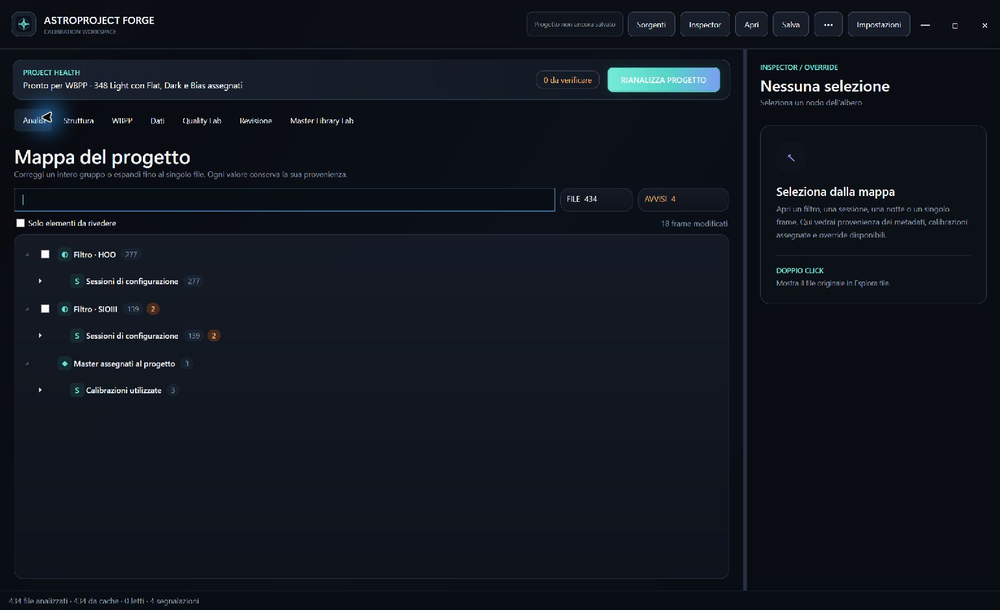
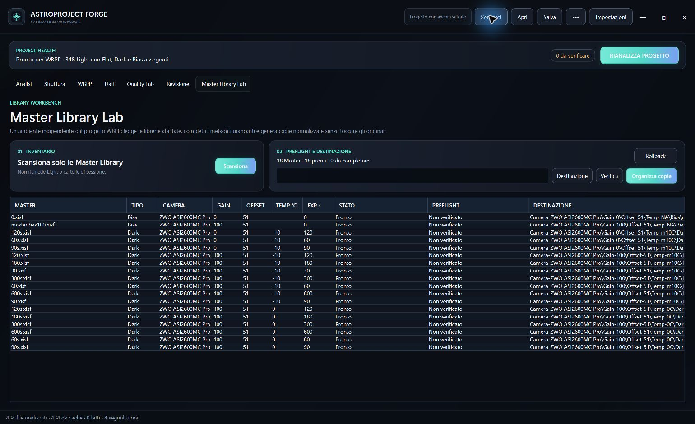

# AstroProject Forge

[Italiano](docs/README.it.md) · **English**

**Turn multi-night FITS/XISF acquisitions into an auditable PixInsight WBPP project.**

AstroProject Forge is a desktop calibration workspace for astrophotographers. It reads image headers, reconstructs astronomical nights and optical-configuration sessions, matches Flat/Dark/Bias frames, highlights ambiguity, and exports a verified project structure with the exact WBPP Grouping Keywords it requires.

> Beta software. Always review calibration assignments before processing valuable data. Source images are treated as read-only.



## Why it exists

A long integration is not just a folder of files. One target may span several filters, nights across midnight, camera rotations, cleaned optics, changed Gain or temperature, and multiple generations of Flats. Grouping only by date or filter can silently calibrate the wrong Lights.

Forge models the project explicitly:

```text
Filter
└── Configuration sessions
    └── Session
        ├── Astronomical nights
        ├── Flat set / Flat epoch
        ├── Master Dark
        └── Master Bias
```

Automatic evidence is used when it is strong. Ambiguous files stay visible and editable. A Flat set can also be linked manually to one Light, several nights, or a complete configuration session.

## Highlights

- FITS and XISF from N.I.N.A. or any acquisition software that writes usable headers;
- configurable astronomical-night boundary, so post-midnight frames remain with the preceding observing night;
- header-first metadata with filename/path fallbacks and visible provenance;
- explainable Flat, Dark and Bias matching across multiple prioritized Master Libraries;
- camera-first Master Library inventory, metadata completion, normalization and verified copy;
- non-destructive per-file and group overrides;
- integration time by filter, configuration session and night;
- adaptive PixInsight WBPP Grouping Keywords (`FLATSET`, `DARKSET`, `BIASSET`, `TARGET`);
- optional Quality Lab for FWHM, eccentricity, noise, SNR, stars, robust outliers, Blink and safe exclusion;
- resumable project export with preflight checks, SHA-256 verification, manifest and reports;
- local diagnostics and support bundles without image pixels.

## Acquisition intelligence


The dashboard makes the dataset measurable: total integration, filter coverage, session boundaries, night counts, Gain, temperature and calibration readiness are visible before PixInsight is opened.

## Master Library Lab



Master Library Lab is independent from project analysis. It can scan Dark/Bias libraries with no Light folders loaded, ask only for metadata that cannot be proven, preview a normalized camera-first layout, then stamp and copy verified files without touching the originals.

Recommended layout:

```text
MasterLibrary/
└── Camera-ZWO-ASI2600MC/
    └── Gain-100/
        └── Offset-51/
            └── Temp--10C/
                ├── Dark/
                │   ├── masterDark_300s.xisf
                │   └── masterDark_600s.xisf
                └── Bias/
                    └── masterBias.xisf
```

The exact names are optional. Headers remain authoritative; folders and filenames are fallback evidence. Reliable masters should identify camera/sensor, geometry and binning, Gain, Offset, setpoint, Dark exposure, readout mode, frame type and master status.

## Downloads

The first public beta is distributed from [GitHub Releases](https://github.com/astropuzzo/astroproject-forge/releases).

| Platform | Package | Notes |
|---|---|---|
| Windows 10/11 x64 | Installer `.exe` or portable `.zip` | Primary QA build |
| Linux x64 / ARM64 | `.deb` or portable `.tar.gz` | X11/XWayland; `.deb` declares native dependencies |
| macOS 13+ Intel / Apple Silicon | `.dmg` or `.zip` | Ad-hoc signed beta; notarization is planned |

Published binaries are self-contained; users do not need to install .NET. PixInsight is not required to inventory or organize a project.

## Quick start

1. Add Light/Flat files or acquisition folders.
2. Add one or more Dark/Bias Master Libraries and set their priority.
3. Set project fallbacks only for metadata that headers and paths cannot provide.
4. Run analysis and review warnings or manual Flat links.
5. Inspect WBPP keywords and the final structure.
6. Choose a destination and export the verified project.
7. Load the generated structure in PixInsight WeightedBatchPreprocessing.

## Safety model

- Originals are never rewritten by project analysis or export.
- Exclusions move verified copies to a separate project area; they do not delete source files.
- Export checks missing files, collisions, free space, overlap, path traversal, long paths, reparse points and interrupted operations.
- Master normalization writes metadata only to new copies and verifies them before completion.

## Build from source

Requirements: [.NET SDK 10](https://dotnet.microsoft.com/download/dotnet/10.0).

```powershell
dotnet run --project dotnet/AstroForge.Core.Tests/AstroForge.Core.Tests.csproj -c Release
dotnet build dotnet/AstroForge.App/AstroForge.App.csproj -c Release
dotnet build dotnet/AstroForge.CrossPlatform/AstroForge.CrossPlatform.csproj -c Release
```

Windows uses the WPF workspace. Linux and macOS use the Avalonia shell over the same Core and shared application model. Cross-platform parity is tracked in [docs/CROSS_PLATFORM_PARITY.md](docs/CROSS_PLATFORM_PARITY.md).

## Project status

This repository is public for transparent beta testing. The software remains under active development; signing/notarization, the end-to-end WBPP compatibility matrix and commercial support are still release gates. See the [ready-to-sell plan](docs/PIANO_READY_TO_SELL.md), [product specification](docs/PRODUCT_SPEC.md), [changelog](docs/CHANGELOG.md) and [release process](docs/RELEASE_PROCESS.md).

## Copyright and contributions

Copyright © 2026 AstroProject Forge. All rights reserved. Public source access does not grant permission to copy, redistribute, modify or sell the software. See [LICENSE](LICENSE) and [CONTRIBUTING](CONTRIBUTING.md).
