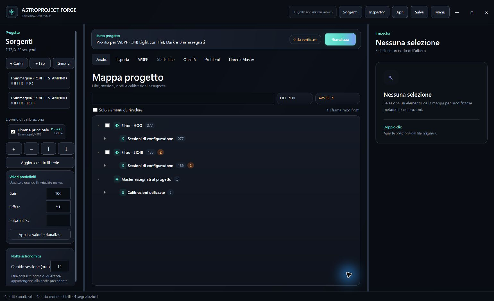
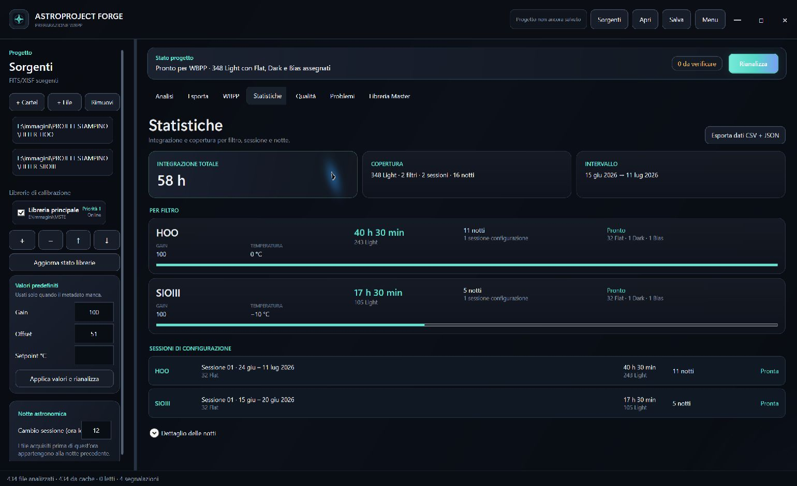
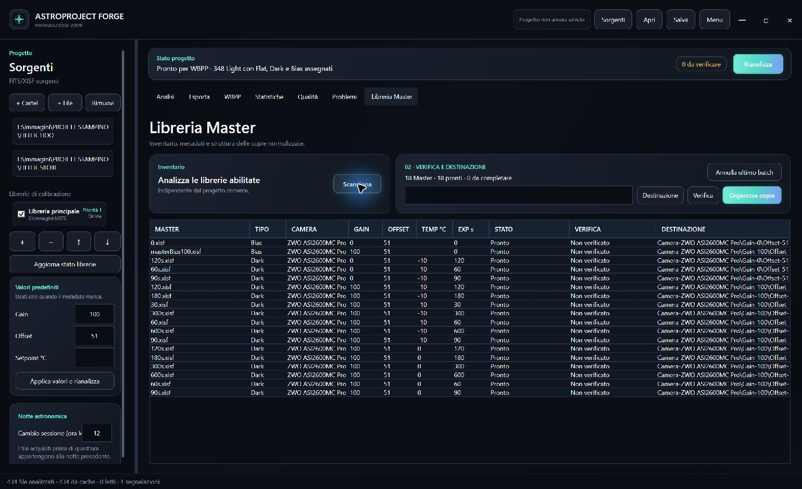

# AstroProject Forge

**Prepare multi-night astrophotography data for PixInsight WBPP.**

**Prepara acquisizioni astrofotografiche multisessione per PixInsight WBPP.**

[Download the latest version](https://github.com/astropuzzo/astroproject-forge/releases/latest) · [User guide](https://github.com/astropuzzo/astroproject-forge/wiki) · [Report a problem](https://github.com/astropuzzo/astroproject-forge/issues/new?template=bug_report.yml)



## English

AstroProject Forge reads FITS and XISF metadata, reconstructs observing nights across midnight, identifies optical configuration sessions and assigns the appropriate Flat, Dark and Bias frames. The resulting project is organized for PixInsight WeightedBatchPreprocessing without rewriting the source images.

### Main features

- FITS/XISF import from N.I.N.A. or any acquisition software with usable headers;
- Filter → configuration session → observing night project structure;
- automatic and manual Flat, Dark and Bias assignment;
- multiple camera-aware Master Libraries;
- integration statistics by filter, session and night;
- project-specific WBPP Grouping Keywords;
- optional frame-quality analysis with FWHM, eccentricity, noise, SNR, Blink and non-destructive exclusions;
- Italian and English interface;
- automatic Windows update download.



### Quick start

1. Add the folders or individual files containing your Light and Flat frames.
2. Add one or more Dark/Bias Master Libraries.
3. Select **Analyze**.
4. Review unresolved items and adjust metadata or calibration links when necessary.
5. Check the suggested WBPP Grouping Keywords.
6. Export the project and load it in PixInsight WeightedBatchPreprocessing.

The suggested Master Library layout starts with the camera:

```text
MasterLibrary/
└── Camera-ZWO-ASI2600MC/
    └── Gain-100/
        └── Offset-51/
            └── Temp--10C/
                ├── Dark/
                └── Bias/
```

Folder names are not mandatory. Headers remain the primary metadata source.

## Italiano

AstroProject Forge legge i metadati FITS e XISF, ricostruisce le notti osservative oltre la mezzanotte, identifica le sessioni di configurazione ottica e assegna i corretti Flat, Dark e Bias. Il progetto risultante è pronto per PixInsight WeightedBatchPreprocessing senza modificare le immagini sorgenti.

### Funzioni principali

- importazione FITS/XISF da N.I.N.A. o qualsiasi software con header utilizzabili;
- struttura Filtro → sessione di configurazione → notte osservativa;
- assegnazione automatica e manuale di Flat, Dark e Bias;
- più Master Library organizzate per camera;
- statistiche di integrazione per filtro, sessione e notte;
- Grouping Keywords WBPP calcolate sul progetto;
- analisi qualità opzionale con FWHM, eccentricità, rumore, SNR, Blink ed esclusioni non distruttive;
- interfaccia italiana e inglese;
- download automatico degli aggiornamenti su Windows.



### Avvio rapido

1. Aggiungi cartelle o singoli file contenenti Light e Flat.
2. Aggiungi una o più Master Library Dark/Bias.
3. Seleziona **Analizza**.
4. Risolvi gli elementi da rivedere modificando i metadati o i collegamenti delle calibrazioni.
5. Controlla le Grouping Keywords WBPP suggerite.
6. Esporta il progetto e caricalo in PixInsight WeightedBatchPreprocessing.

## Downloads

| Platform | Packages |
| --- | --- |
| Windows 10/11 x64 | Installer `.exe`, portable `.zip` |
| Linux x64 / ARM64 | Package `.deb`, portable `.tar.gz` |
| macOS 13+ Intel / Apple Silicon | Disk image `.dmg`, portable `.zip` |

Packages are self-contained; .NET does not need to be installed separately. PixInsight is only required after export.

## Build

Requires [.NET SDK 10](https://dotnet.microsoft.com/download/dotnet/10.0).

```powershell
dotnet run --project dotnet/AstroForge.Core.Tests/AstroForge.Core.Tests.csproj -c Release
dotnet build dotnet/AstroForge.App/AstroForge.App.csproj -c Release
dotnet build dotnet/AstroForge.CrossPlatform/AstroForge.CrossPlatform.csproj -c Release
```

Windows uses WPF. Linux and macOS use Avalonia over the same Core and application model.

## Project

Concept and product direction by [Gianmarco Spagnoli (@astropuzzo)](https://github.com/astropuzzo). Developed with AI-assisted programming tools.

Copyright © 2026 Gianmarco Spagnoli. Official binaries are free for personal, non-commercial use. See [LICENSE](LICENSE).
