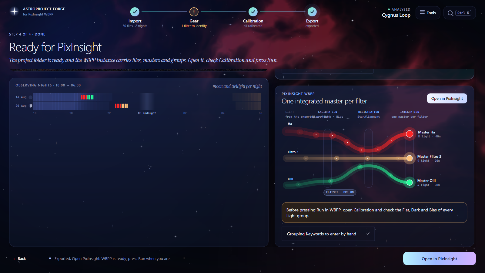

# AstroProject Forge

**Prepare multi-night astrophotography data for PixInsight WBPP.**

**Prepara acquisizioni astrofotografiche multisessione per PixInsight WBPP.**

[Download the latest version](https://github.com/astropuzzo/astroproject-forge/releases/latest) · [User guide](https://github.com/astropuzzo/astroproject-forge/wiki) · [Report a problem](https://github.com/astropuzzo/astroproject-forge/issues/new?template=bug_report.yml)


## English

AstroProject Forge reads FITS and XISF metadata, reconstructs observing nights across midnight, identifies optical configuration sessions and assigns the appropriate Flat, Dark and Bias frames. The resulting project is organized for PixInsight WeightedBatchPreprocessing without rewriting the source images.

### Main features

- FITS/XISF import from N.I.N.A. or any acquisition software with usable headers;
- Filter → configuration session → observing night project structure;
- automatic and manual Flat, Dark and Bias assignment;
- multiple camera-aware Master Libraries, linked once and remembered for every project;
- camera, optics, reducer, pixel size and filters read from the headers and always correctable: say which camera and filters you really used;
- integration statistics by filter, session and night;
- project-specific WBPP Grouping Keywords;
- optional frame-quality analysis with FWHM, eccentricity, noise, SNR, Blink and non-destructive exclusions;
- instant incremental updates: registered files are not reopened, and only new files are copied;
- one-click PixInsight WBPP instance with files, masters, grouping keywords and output directory preloaded;
- Italian and English interface;
- one-click Windows updates with verified download, installation and automatic restart.


### Quick start

The window follows four steps, always in order. One button at the bottom right does the next thing the project needs, and the line beside it says why.

| Step | Page | Action |
| --- | --- | --- |
| 1 | Import | Link your **Master Library** once (Dark and Bias, remembered for every project), add the captures (or drop folders and files anywhere on the window), then **Analyze**. The analysis carries on to step 2 by itself. |
| 2 | Gear | Check camera, optics, reducer, pixel size and filters read from the headers. Every one can be changed (**Change**, or tap a part of the optical train), including the ones Forge recognised; what you choose is remembered for that camera. |
| 3 | Calibration | See how many Lights have Flat, Dark and Bias. When Forge cannot choose by itself it asks one thing at a time. |
| 4 | Export | Name the project, choose the destination and export. Repeating the export adds only new files. Then **Open in PixInsight**. |

Statistics, Quality, frame metadata and the Master Library check are tools (top right), not steps.

After export, **Create and open in PixInsight** opens the populated WBPP window; it does not start processing. Check **Calibration**, then press **Run** when ready. The project also contains a `.xpsm` process icon and a `.js` launcher. To use the XPSM manually, load its process icon and apply the Script instance globally. Direct launch requires PixInsight 1.9.4 or newer in its standard installation location; tested with PixInsight 1.9.5 / WBPP 3.1.0 on Windows.

Master Libraries are saved in the application settings, not inside a project. Opening
or creating a project never removes the configured libraries.

### Keyboard

`Ctrl+O` opens a project, `Ctrl+S` saves it, `Ctrl+Shift+S` saves a copy,
`Ctrl+Enter` analyzes it, `Ctrl+,` opens the menu and `F1` opens the guide.
Use `Alt+1` through `Alt+4` to move between the steps, `Alt+5` through `Alt+8` for the tools, `Ctrl+K` for every command.

The suggested Master Library layout starts with the camera:

```text
MasterLibrary/
└── Camera-ZWO-ASI2600MC/
    └── Gain-100/
        └── Offset-51/
            └── Temp--10C/
                ├── Dark/
                └── Bias/
```

Folder names are not mandatory. Headers remain the primary metadata source.

## Italiano

AstroProject Forge legge i metadati FITS e XISF, ricostruisce le notti osservative oltre la mezzanotte, identifica le sessioni di configurazione ottica e assegna i corretti Flat, Dark e Bias. Il progetto risultante è pronto per PixInsight WeightedBatchPreprocessing senza modificare le immagini sorgenti.

### Funzioni principali

- importazione FITS/XISF da N.I.N.A. o qualsiasi software con header utilizzabili;
- struttura Filtro → sessione di configurazione → notte osservativa;
- assegnazione automatica e manuale di Flat, Dark e Bias;
- più Master Library organizzate per camera, collegate una volta e ricordate per ogni progetto;
- camera, ottica, riduttore, pixel e filtri letti dagli header e sempre correggibili: indichi tu quale camera e quali filtri hai usato davvero;
- statistiche di integrazione per filtro, sessione e notte;
- Grouping Keywords WBPP calcolate sul progetto;
- analisi qualità opzionale con FWHM, eccentricità, rumore, SNR, Blink ed esclusioni non distruttive;
- aggiornamenti incrementali immediati: i file registrati non vengono riaperti e si copiano solo quelli nuovi;
- istanza PixInsight WBPP con file, Master, keyword e cartella risultati già caricati;
- interfaccia italiana e inglese;
- aggiornamenti Windows in un clic con download verificato, installazione silenziosa e riavvio automatico.



### Avvio rapido

La finestra segue quattro passi, sempre in ordine. Un solo pulsante in basso a destra fa la prossima cosa che serve al progetto e la riga accanto dice perché.

| Passo | Pagina | Azione |
| --- | --- | --- |
| 1 | Importa | Collega una volta sola la **Master Library** (Dark e Bias, resta salvata per ogni progetto), aggiungi le acquisizioni (o trascina cartelle e file ovunque sulla finestra), poi **Analizza**. L’analisi prosegue da sola al passo 2. |
| 2 | Strumento | Controlla camera, ottica, riduttore, pixel e filtri letti dagli header. Ognuno si può cambiare (**Cambia**, oppure tocca una parte del treno ottico), anche quelli già riconosciuti; ciò che scegli resta salvato per quella camera. |
| 3 | Calibrazioni | Vedi quanti Light hanno Flat, Dark e Bias. Quando Forge non può scegliere da solo, ti chiede una cosa alla volta. |
| 4 | Esporta | Dai un nome al progetto, scegli la destinazione ed esporta. Le esportazioni successive aggiungono solo i file nuovi. Poi **Apri in PixInsight**. |

Statistiche, Qualità, metadati dei frame e verifica della Master Library sono strumenti (in alto a destra), non passi.

Dopo l’esportazione, **Crea e apri in PixInsight** apre WBPP già compilato, senza avviare l’elaborazione. Controlla **Calibration**, poi premi **Run** quando sei pronto. Nel progetto trovi anche l’icona `.xpsm` e lo script di apertura `.js`. Per usare l’XPSM manualmente, carica l’icona e applica globalmente l’istanza Script. L’apertura diretta richiede PixInsight 1.9.4 o successivo nel percorso d’installazione standard; verificata su Windows con PixInsight 1.9.5 / WBPP 3.1.0.

Le Master Library sono salvate nelle impostazioni dell'app, non nel progetto. Aprire
o creare un progetto non rimuove le librerie configurate.

### Tastiera

`Ctrl+O` apre un progetto, `Ctrl+S` lo salva, `Ctrl+Shift+S` salva una copia,
`Ctrl+Invio` avvia l'analisi, `Ctrl+,` apre il menu e `F1` apre la guida.
Usa `Alt+1`–`Alt+4` per spostarti tra i passi, `Alt+5`–`Alt+8` per gli strumenti, `Ctrl+K` per tutti i comandi.

## Downloads

| Platform | Packages |
| --- | --- |
| Windows 10/11 x64 | Installer `.exe`, portable `.zip` |
| Linux x64 / ARM64 | Package `.deb`, portable `.tar.gz` |
| macOS 13+ Intel / Apple Silicon | Disk image `.dmg`, portable `.zip` |

Packages are self-contained; .NET does not need to be installed separately. PixInsight is only required after export.

### Installing on macOS

1. Download the DMG matching your Mac: `osx-arm64` for Apple Silicon or `osx-x64` for Intel.
2. Open the DMG and drag **AstroProject Forge** to **Applications**.
3. Because the current free builds are not Apple-notarized, the first launch may be blocked. Open **System Settings → Privacy & Security**, find the AstroProject Forge message and select **Open Anyway**. Confirm once.

Do not disable Gatekeeper globally. Future updates are downloaded and hash-checked by the app, but macOS still asks for installation confirmation.

### Installazione su macOS

1. Scarica il DMG corretto: `osx-arm64` per Apple Silicon oppure `osx-x64` per Mac Intel.
2. Apri il DMG e trascina **AstroProject Forge** in **Applicazioni**.
3. Le build gratuite attuali non sono notarizzate da Apple. Se il primo avvio viene bloccato, apri **Impostazioni di Sistema → Privacy e Sicurezza**, individua il messaggio relativo ad AstroProject Forge e seleziona **Apri comunque**. Conferma una sola volta.

Non disattivare globalmente Gatekeeper. Gli aggiornamenti vengono scaricati e verificati dall’app, ma macOS richiede comunque la conferma d’installazione.

## Build

Requires [.NET SDK 10](https://dotnet.microsoft.com/download/dotnet/10.0).

```powershell
dotnet run --project dotnet/AstroForge.Core.Tests/AstroForge.Core.Tests.csproj -c Release
dotnet build dotnet/AstroForge.CrossPlatform/AstroForge.CrossPlatform.csproj -c Release
```

Windows, macOS and Linux run the same Avalonia app (`AstroProjectForge`) over the same Core and application model. The Windows release is published self-contained and single-file for `win-x64` and packaged with Inno Setup (`qa-gate.ps1`, `build-distribution.ps1`).

## Project

Created by [Gianmarco Spagnoli (@astropuzzo)](https://github.com/astropuzzo).

Copyright © 2026 Gianmarco Spagnoli. Official binaries are free for personal, non-commercial use. See [LICENSE](LICENSE).
