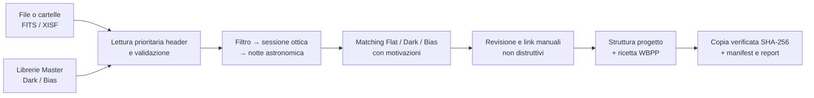

# AstroProject Forge

**Italiano** · [English](../README.md)

**Trasforma acquisizioni FITS/XISF multisessione prodotte da qualunque software in un progetto pronto
per PixInsight WBPP, senza organizzare centinaia di file a mano.**

AstroProject Forge è un'applicazione Windows nativa che legge i metadati
FITS/XISF, ricostruisce sessioni osservative e configurazioni del treno ottico,
abbina Flat, Dark e Bias e genera una struttura verificabile per
WeightedBatchPreprocessing.

> Il progetto è in sviluppo attivo e non è ancora una release commerciale.
> Correttezza delle calibrazioni e sicurezza degli originali hanno precedenza
> sulla quantità di funzioni.


## Il problema che risolve

Un target debole può richiedere settimane di acquisizione. Nello stesso progetto
possono esserci più filtri, notti che attraversano la mezzanotte, cambi del treno
ottico e diversi set di Flat. Una semplice divisione per data non basta:

- sei notti HOO possono condividere lo stesso Flat Set;
- dopo un cambio filtro o rotazione serve una nuova configurazione;
- tornando a HOO, i nuovi Flat non devono calibrare le vecchie sessioni;
- pulizia di specchio o filtro può creare un'altra Flat Epoch anche senza
  cambiare il nome del filtro;
- Dark e Bias devono corrispondere a camera, geometria, Gain, Offset,
  temperatura, esposizione e readout mode.

AstroProject Forge costruisce una mappa esplicita del progetto e segnala ciò che
non può dimostrare, invece di inventare un abbinamento.

## Come funziona



1. Selezioni una o più cartelle di acquisizione e le librerie Master.
2. L'app legge solo gli header: i pixel non vengono caricati durante l'analisi.
3. Le immagini vengono organizzate come
   `Filtro → Sessioni di configurazione → Notti / Flat / Master`.
4. Il motore propone le calibrazioni compatibili e spiega errori o ambiguità.
5. Puoi correggere metadati e collegare manualmente un Flat Set a una notte, a
   più notti o a un'intera sessione.
6. L'app suggerisce le Grouping Keywords WBPP necessarie, inclusi valori
   `Pre/Post` per `FLATSET`, `DARKSET`, `BIASSET` e `TARGET`.
7. L'esportazione genera una cartella pronta da controllare in PixInsight.

## Funzioni implementate

### Project Intelligence

- parser FITS e XISF;
- diagnostica locale privacy-safe con codici errore ricercabili, operazioni correlate, Centro diagnostica interno e pacchetto ZIP;
- classificazione Light, Flat, Dark, Bias e Dark-flat;
- notte astronomica configurabile: i file dopo mezzanotte possono restare nella
  sessione della sera precedente;
- Flat Epoch automatiche e link manuale multisessione;
- albero gerarchico invece di una lista infinita di file;
- override singoli e di gruppo con provenienza del valore;
- dashboard con ore per filtro, sessione e notte;
- intervalli temporali, Gain, temperatura e copertura calibrazioni;
- esportazione statistiche CSV e JSON.
- interfaccia Windows glass premium con animazioni coerenti, tabelle, alberi,
  input e gerarchia visiva progettata per la revisione delle calibrazioni.

### PixInsight WBPP

- matching motivato di Flat, Dark e Bias;
- preferenza per Master provenienti dalla libreria configurata;
- ricetta adattiva delle Grouping Keywords;
- anteprima della struttura finale;
- guida WBPP generata insieme al progetto;
- manifest con assegnazioni e decisioni utilizzate.

### Sicurezza e ripresa

- gli originali restano in sola lettura;
- copia tramite staging riprendibile;
- verifica SHA-256;
- file progetto portabile `.astroforge` con salvataggio atomico;
- autosalvataggio dopo il primo salvataggio esplicito;
- recovery journal atomico con scelta esplicita Ripristina/Ignora dopo un'interruzione;
- cache incrementale degli header con invalidazione dei soli file modificati;
- comando `Pulisci cache` che non elimina immagini astronomiche.
- Master Library Lab con compilazione guidata dei metadati mancanti, nuova
  struttura normalizzata, keyword FITS/XISF sulle sole copie, verifica SHA-256 e
  manifest finale.

## Struttura attesa

```text
HOO
└── Sessioni
    ├── Sessione 01 · 15–28 giu
    │   ├── Notti osservative
    │   ├── Flat Set collegato
    │   ├── Master Dark
    │   └── Master Bias
    └── Sessione 02 · 02–05 lug
        └── ...
SIOIII
└── Sessioni
    └── ...
Senza filtro
└── Sessioni sensore
    ├── Dark
    └── Bias
```

Questa gerarchia distingue la **notte di calendario** dalla **sessione
astronomica** e dalla **sessione di configurazione ottica**. Sono concetti
diversi e non devono essere ridotti tutti a `DATE-OBS`.

## Stato della roadmap

| Area | Stato |
|---|---|
| Analisi FITS/XISF e albero multisessione | Operativa |
| Flat Epoch e link manuali | Operativa |
| Dashboard e statistiche | Operativa |
| File progetto `.astroforge` | Operativo, migrazioni da completare |
| Cache incrementale header | v1 operativa, backend SQLite pianificato |
| Coda di revisione guidata | In sviluppo |
| Gestore multi-libreria | v1 operativo: priorità e stato online/offline |
| Installer, firma e aggiornamenti | Pianificato |
| Matrice WBPP end-to-end | Da completare prima della vendita |

Il backlog completo, con criteri di accettazione, è in
[PIANO_READY_TO_SELL.md](docs/PIANO_READY_TO_SELL.md).

## Prerequisiti e Master Library

Per usare l'app servono le cartelle contenenti i Light e i relativi Flat. Una
Master Library di Dark e Bias è fortemente consigliata, ma il percorso non è
codificato nel programma e può essere scelto dall'utente.

La struttura ideale rende leggibili almeno Gain, temperatura ed esposizione:

```text
MasterLibrary/
├── Camera-ZWO-ASI2600MC/
│   ├── Gain-100/
│   │   ├── Offset-50/
│   │   │   ├── Temp--10C/
│   │   │   │   ├── Dark/
│   │   │   │   │   ├── masterDark_60s.xisf
│   │   │   │   │   ├── masterDark_300s.xisf
│   │   │   │   │   └── masterDark_600s.xisf
│   │   │   │   └── Bias/
│   │   │   │       └── masterBias.xisf
│   │   │   └── Temp-0C/
│   │   │       └── ...
│   │   └── Offset-51/
│   │       └── ...
│   └── Gain-0/
│       └── ...
└── Camera-Secondaria/
    └── ...
```

Non è necessario usare esattamente questi nomi. L'app prova prima gli header
FITS/XISF e usa cartelle e nome file solo come fallback. Per un matching
affidabile i Master dovrebbero dimostrare:

- camera/sensore e geometria;
- binning e ROI;
- Gain e Offset;
- temperatura di setpoint;
- esposizione per i Dark;
- readout mode, se la camera ne offre più di una;
- stato Master e tipo frame.

Se un Master non contiene Gain o Offset, è possibile impostare un default di
progetto o un profilo della libreria. Un valore predefinito viene applicato solo
quando il metadato manca e non sostituisce mai un header valido. File duplicati,
campi contraddittori o candidati equivalenti vengono inviati alla Coda di
revisione.

## Sviluppo

### Requisiti

- Windows 10/11;
- .NET SDK 10 per compilare;
- PixInsight non è necessario per analizzare o organizzare i file.

```powershell
dotnet run --project dotnet/AstroForge.App/AstroForge.App.csproj
```

### Test

I test usano fixture sintetiche e non richiedono scatti astronomici personali.

```powershell
dotnet run --project dotnet/AstroForge.Core.Tests/AstroForge.Core.Tests.csproj -c Release
```

### Build Windows autonoma

```powershell
dotnet publish dotnet/AstroForge.App/AstroForge.App.csproj `
  -c Release -r win-x64 --self-contained true `
  -p:PublishSingleFile=true -o dist-dotnet
```

## Principi del progetto

- Nessun abbinamento scientifico senza una motivazione verificabile.
- Un dato mancante resta mancante finché una regola o l'utente non lo risolve.
- Le correzioni sono overlay: gli header originali non vengono riscritti.
- Le operazioni distruttive non devono essere confuse con pulizia cache o
  rimozione dalla memoria.
- Nessun FITS/XISF personale o artefatto di build viene versionato nel
  repository.

## Licenza e distribuzione

Licenza commerciale, installer e canale di distribuzione non sono ancora
definiti. Il repository è privato durante lo sviluppo pre-release.
