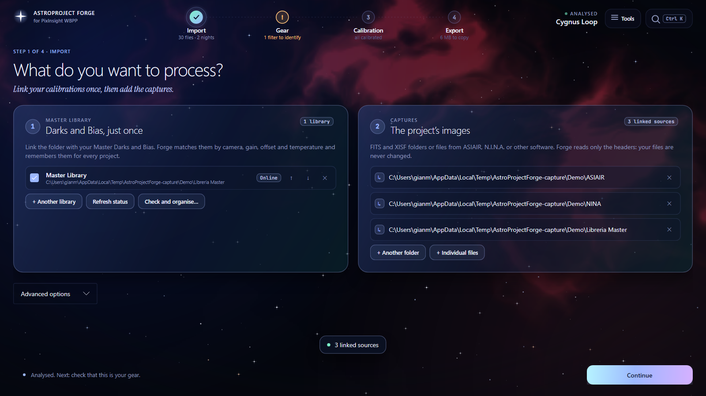
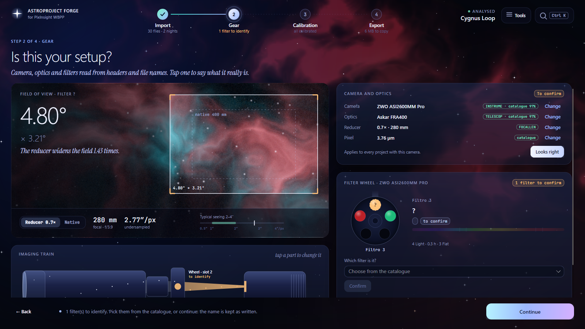

# AstroProject Forge

[Download](https://github.com/astropuzzo/astroproject-forge/releases/latest) · [Guida](https://github.com/astropuzzo/astroproject-forge/wiki) · [Segnala un problema](https://github.com/astropuzzo/astroproject-forge/issues/new?template=bug_report.yml)

AstroProject Forge organizza acquisizioni FITS/XISF multisessione per PixInsight WeightedBatchPreprocessing. Ricostruisce le notti oltre la mezzanotte, separa filtri e sessioni ottiche, abbina Flat/Dark/Bias e genera la struttura e le Grouping Keywords richieste dal progetto.

## Flusso essenziale

Quattro passi, sempre in ordine, con un solo pulsante in basso a destra che fa la prossima cosa che serve:

1. **Importa**: collega una volta sola la Master Library Dark/Bias, aggiungi le acquisizioni Light/Flat e premi **Analizza**.
2. **Strumento**: controlla camera, ottica, riduttore, pixel e filtri letti dagli header; ognuno si può correggere.
3. **Calibrazioni**: risolvi, una alla volta, soltanto le scelte che Forge non può fare da solo.
4. **Esporta**: dai un nome al progetto, scegli la destinazione ed esporta, poi apri l’istanza WBPP in PixInsight.

Negli strumenti (in alto a destra) trovi statistiche per filtro, sessione e notte, metadati e collegamenti manuali dei Flat Set, gestione indipendente della Master Library e analisi qualità opzionale con Blink.

I pacchetti Windows, Linux e macOS sono disponibili nella pagina [Releases](https://github.com/astropuzzo/astroproject-forge/releases/latest). Non è necessario installare .NET separatamente.

Copyright © 2026 Gianmarco Spagnoli. Software gratuito per uso personale e non commerciale.
